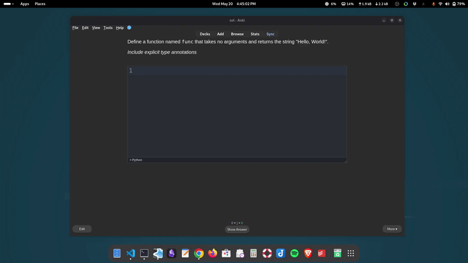

# Code Your Answer

An Anki addon for coding practice. Type your answers in an IDE-style input field and get an instant, character-level diff against the solution.



## ⚠️ Compatibility

This add-on is **only supported on Anki Desktop**.

It relies on features that are not available on AnkiMobile and AnkiWeb.

## Features

- **Custom Note Type**: Details below.
- **IDE-Style Input**: Powered by CodeMirror.
- **Three-Part Review**:
    - **Diff**: A character-level comparison between your attempt and the predefined solution.
    - **Your Attempt**: A syntax-highlighted view of exactly what you typed for your convenience.
    - **Expected Answer**: A syntax-highlighted view of the predefined solution for your convenience.  

## Note Type Fields

The add-on creates a new note type (Code Your Answer) with the following fields:

| Field | Required | Description |
|-------|----------|-------------|
| **Front** | ✅ Yes | The question/prompt |
| **Language** | ✅ Yes | Language code (e.g., `python`, `javascript`, `rust`) |
| **Back** | ✅ Yes | Your code answer |
| **Back Extra** | ❌ Optional | Additional notes, explanations, or context |

### Understanding the Diff

The Diff section provides a comparison of your code against the predefined solution. It uses the following color-coding to highlight discrepancies:

| Color | Meaning | Description |
| --- | --- | --- |
|  Green| **Match** | Characters you typed that match the solution exactly. |
|  Grey| **Omissions** | Code that is in the solution but is missing from your attempt. |
|  Red| **Extra** | Characters you typed that are not in the solution (typos, new names, extra logic etc). |


## Creating Cards

### The Problem with Anki's Default Editor

Anki's built-in editor converts whitespace to HTML entities (`&nbsp;` for spaces, `<br>` for line breaks). This causes issues with the diff comparison, as your code won't match the solution due to formatting differences rather than actual code differences.

### Solutions

#### Best: Obsidian_to_Anki

Use [Obsidian_to_Anki](https://github.com/Pseudonium/Obsidian_to_Anki) to create cards from Obsidian markdown files. The plugin automatically converts code blocks to a format that works seamlessly with the diff, and looks great overall (in case you need formatted and syntax highighted code blocks on the front side and Back Extra)

**Tutorial:** [Obsidian_to_Anki - How to use (3:31)](https://youtu.be/OqVs1Sw-Ahg?t=3031&si=hkb91izv8oku1JNj)

This is the recommended workflow when using this addon.

#### Good: Syntax Highlighter Add-on

Install [Syntax Highlighter](https://ankiweb.net/shared/info/272582198) to create cards directly in Anki with proper code formatting (tested with default settings).

#### Not Recommended: Manual HTML

Manual HTML wrapping is unnecessarily cumbersome. If this approach is unavoidable, use an external editor (such as VS Code) to format the code:

```html
<pre><code>def greet(name) -> str:
    return f"Hello, {name}"</code></pre>
```

Copy the entire block (including tags) and paste into the Back field. Obsidian_to_Anki or Syntax Highlighter are strongly preferred alternatives.

## Field Guidelines

- **Back**: Include only the code you want compared in the diff
- **Back Extra**: Use for explanations, notes, or additional context that should not affect grading

The diff only compares the Back field code, so any supplementary information should go in Back Extra.

## Keyboard Shortcuts

Designed for a hands-on-keyboard workflow:

- **`Tab`**: Performs **Indentation** by inserting 4 spaces (for all languges). This ensures your code structure is clean and readable, a standard requirement for almost all programming languages (especially Python!).
- **`Ctrl + Enter`** (or `Cmd + Enter`): Submits your answer and reveals the back of the card.
- **`Ctrl + /`** (or `Cmd + /`): Toggles a **line comment** on the selected line(s) using the correct syntax for the active language (e.g. `//` in JS, `#` in Python).
- **`Shift + Alt + A`** (or `Alt + A` on Windows) / **`Ctrl + Shift + A`**: Toggles a **block comment** around the selection for languages that support it (e.g. `/* */` in JS/CSS).

## Editor Configuration

Go to **Tools → Add-ons → Code Your Answer → Config** to customise the editor. Restart Anki after saving for changes to take effect.

| Option | Default | Description |
|--------|---------|-------------|
| `theme` | `""` | Editor colour theme. Empty string uses the default themes (GitHub Light / One Dark) that follow Anki's light/dark mode. Set to a theme name to pin it regardless of mode. See the full list at [fsegurai.github.io/codemirror-themes](https://fsegurai.github.io/codemirror-themes/). View themes in action at the [Playground](https://fsegurai.github.io/codemirror-themes/playground.html). |
| `indentUnit` | `4` | Number of spaces per indentation level. |
| `indentWithTab` | `true` | Allow the `Tab` key to indent. |
| `autocompletion` | `false` | Show inline code completion suggestions. Disabled by default — keeping it off is recommended when using the editor for learning. |
| `fontSize` | `14` | Font size of the editor content in pixels. |

> Some basic editor behaviours, such as bracket matching and auto-closing brackets, are hardcoded and cannot be changed. More options will be added in future releases.

## Supported Languages

**Notes:** 
- Vue and Angular support template syntax only. For component logic, use JavaScript or TypeScript.
- WebAssembly support is for the WebAssembly Text Format (WAST) only, not binary WebAssembly.

| Language | Acceptable Aliases (Case-Insensitive) |
| --- | --- |
| **JavaScript** | `js`, `jsx`, `node`, `javascript`, `ecmascript` |
| **TypeScript** | `ts`, `tsx`, `typescript` |
| **Python** | `py`, `py3`, `python3`, `python`, `pypy` |
| **Rust** | `rs`, `rustlang`, `rust` |
| **PHP** | `php`, `php8`, `php7` |
| **Go** | `go`, `golang` |
| **Zig** | `zig`, `ziglang` |
| **C++** | `cpp`, `c++`, `cc`, `hpp`, `h++` |
| **C** | `c`, `h` |
| **Java** | `java`, `jar` |
| **C#** | `cs`, `csharp`, `c#` |
| **HTML** | `html`, `htm` |
| **CSS** | `css` |
| **XML** | `xml`, `svg` |
| **Sass** | `sass`, `scss` |
| **Less** | `less` |
| **Vue** | `vue` |
| **Angular** | `angular`, `ng` |
| **SQL** | `sql`, `mysql`, `postgres`, `psql` |
| **WebAssembly** | `wasm`, `wat` |
| **Shell** | `sh`, `bash`, `zsh`, `shell`, `batch`, `ps1` |
| **YAML** | `yaml`, `yml` |
| **JSON** | `json` |
| **Markdown** | `md`, `markdown` |
| **Swift** | `swift` |
| **Kotlin** | `kt`, `kotlin` |
| **Dart** | `dart`, `flutter` |
| **Ruby** | `rb`, `ruby`, `rails` |
| **Scala** | `scala` |
| **R** | `r`, `rscript` |
| **MATLAB** | `matlab`, `m` |

## Language Testing

Manual test status, verified by loading the language in the editor and confirming the following work correctly: syntax highlighting, auto indentation, auto-closing brackets, and bracket matching.

| Language | Tested |
|----------|--------|
| JavaScript | ✅ |
| TypeScript | ✅ |
| Python | ✅ |
| Rust | ✅ |
| PHP | ✅ |
| Go | ✅ |
| Zig | ✅ |
| C++ | ✅ |
| C | ✅ |
| Java | ✅ (see known issues section below) |
| C# | ✅ (see known issues section below)|
| HTML | ✅ |
| CSS | ✅ |
| XML | ✅ |
| Sass | ✅ |
| Less | ✅ |
| Vue | ✅ |
| Angular | ✅ |
| SQL | ✅ |
| WebAssembly | ✅ |
| Shell | ✅ (see known issues section below)|
| YAML | ✅ |
| JSON | ✅ |
| Markdown | ✅ |
| Swift | ✅ |
| Kotlin | ✅ |
| Dart | ✅ |
| Ruby | ✅ |
| Scala | ✅ |
| R | ✅ |
| MATLAB | ✅ (see known issues section below)|

### Known Issues

#### Auto-indent breaks in some C-style languages without a top-level wrapper

In languages like Java and C#, writing code outside of a class can cause the cursor to land at column 0 after certain lines (e.g. after `};`). Manually pressing **Tab** to indent should still work.

**Affected (no wrapper):**
```java
String greet(String name) {
    int[] items = {1, 2, 3};
    // pressing Enter here → cursor lands at col 0
```

**Not affected (inside a class):**
```java
class Greeter {
    String greet(String name) {
        int[] items = {1, 2, 3};
        // pressing Enter here → correct indentation
```

#### `<script>` and `<style>` tags do not auto-close in HTML mode

Typing `<script>` or `<style>` will not automatically insert the closing tag. This is a consequence of how CodeMirror's HTML language support works: these tags embed nested languages (JavaScript and CSS respectively), and it seems to prevent their tags from auto closing.All other HTML tags auto-close as expected.

#### Languages using CodeMirror Legacy Modes

The following languages use CodeMirror 5 legacy modes packages. Syntax highlighting works, but auto-indentation may be limited or unavailable. Manually pressing **Tab** to indent should still work.

- Shell
- MATLAB

## Request a Language

Don't see your language? Check if CodeMirror supports it:
- **Modern languages:** https://code.haverbeke.berlin/codemirror
- **Legacy modes:** https://code.haverbeke.berlin/codemirror/legacy-modes

If you find it there, [open an issue](https://github.com/solmarita/code-your-answer/issues/new) with the language name and I'll add it. If it's not there, I'll do my best to find a third-party package.

## Installation

Since this addon is not yet published on AnkiWeb, it must be installed manually.

### Option 1: Download as a ZIP (Easiest)

1. **Download the code**: Click the green **Code** button at the top of this page and select **Download ZIP**. 
2. **Unzip the folder**: Extract the contents of the ZIP file on your computer.
    
### Option 2: Clone with Git (Best for Updates)

If you have Git installed, run the following in your terminal:

```bash
git clone https://github.com/solmarita/code-your-answer.git
```

### Finalizing the Install

1. **Locate your Anki addons folder**:
    
    - Open Anki, go to `Tools > Add-ons`.  
    - Click **View Files** to open the `addons21` directory.
        
2. **Copy the project folder**: Move the `code-your-answer` folder into the `addons21/` directory.
3. **Restart Anki**: Close and reopen Anki to activate the addon.

## Development

**DISCLAIMER:** This addon is under active development and may change frequently!

### Setup

**Option 1: Clone directly to Anki's addon folder**
```bash
cd <path_to_anki_addons_folder>
git clone https://github.com/solmarita/code-your-answer.git
cd code-your-answer
```

**Option 2: Clone elsewhere and symlink**
```bash
# Clone to your preferred location
git clone https://github.com/solmarita/code-your-answer.git
cd code-your-answer

# Create symlink in Anki's addon folder
# macOS/Linux:
ln -s "$(pwd)" <path_to_anki_addons_folder>/code-your-answer

# Windows (run as Administrator):
mklink /D "<path_to_anki_addons_folder>\code-your-answer" "%CD%"
```

**Finding your Anki addons folder:**    
    - Open Anki, go to `Tools > Add-ons`.  
    - Click **View Files** to open the `addons21` directory.

**Install dependencies:**
```bash
python3 -m venv venv
source venv/bin/activate  # Windows: venv\Scripts\activate
pip install -r requirements.txt
npm install

# Enable dev mode
touch .dev  # Windows: type nul > .dev

# Build
npm run build
```

### Development Workflow

```bash
# Make changes to __init__.py or src/ files
npm run build
# Restart Anki to see changes
```

**Tip:** Install [AnkiRestart](https://ankiweb.net/shared/info/1766024579) for quick reloads during development.

### Dev Mode

The `.dev` file enables template auto-updates on Anki restart during development.

**Disable dev mode before release:**
```bash
rm .dev  # macOS/Linux
# Windows: del .dev
```